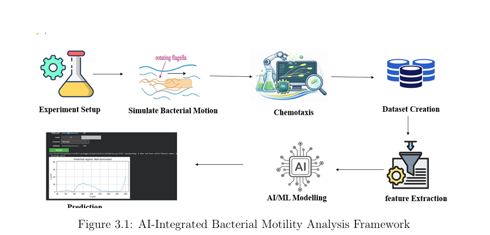

# BacMotionAI: Technical Project Report

## 1. Abstract
BacMotionAI represents an innovative approach to understanding bacterial motility in confined micro-environments. By combining physics-based simulation with machine learning (ML), this project models the run-and-tumble behavior of *E. coli* bacteria within microfluidic channels under various chemical stimuli. The simulation generates complex trajectories, from which 14 distinct motility features are extracted. These features are then fed into robust machine learning models to classify the motility into five distinct regimes. The objective is to bridge the gap between microscopic hydrodynamic interactions and macroscopic behavioral classification, providing an accessible tool for researchers in microbiology, drug delivery, and microfluidics.

## 2. Introduction
Bacterial motility is a critical factor in a myriad of biological and engineering processes. In natural environments, motility allows bacteria to find nutrients and avoid toxins. In medical and industrial contexts, understanding this motion is essential for the design of targeted drug delivery systems, the mitigation of biofilm formation on medical implants, and the optimization of microfluidic devices. Traditional analysis of bacterial trajectories is often manual and subjective. BacMotionAI automates this process by employing a rigorous physics engine and advanced machine learning techniques to categorize bacterial behavior efficiently and accurately.

## 3. Problem Statement & Objectives
The primary challenge in analyzing bacterial motility lies in the vast amount of complex, noisy trajectory data generated in confined spaces. Manual classification is practically impossible. 
This project sets out to achieve the following four objectives:
1.  **Trajectory Visualization:** Create an intuitive, real-time simulation of bacterial motion under physical constraints and chemical gradients.
2.  **Chemical Analysis:** Model the effect of different chemical stimuli (attractants, repellents, antibiotics) on motility.
3.  **ML Classification:** Develop robust ML models to accurately classify motility into 5 regimes based on extracted features.
4.  **Anti-Overfitting Measures:** Implement strict data processing pipelines to ensure models generalize well to unseen data.

## 4. Literature Survey
This project builds upon established foundational research in bacterial hydrodynamics and machine learning:
*   **Run-and-Tumble Model:** The core motion algorithm is inspired by the seminal work of Berg and Brown (1972) on *E. coli* chemotaxis.
*   **Hydrodynamic Wall Interactions:** The complex behavior of bacteria near solid boundaries, including hydrodynamic trapping and wall-hugging, draws from the models proposed by Berke et al. (2008).
*   **ML for Biological Classification:** Recent advancements in applying Random Forests and Neural Networks to biological time-series data informed our classification pipeline.
*(Note: Full academic references require verification against original publications.)*

## 5. System Architecture
The BacMotionAI pipeline follows a structured, modular approach:
Experiment Setup &rarr; Simulate Bacterial Motion &rarr; Chemotaxis Integration &rarr; Dataset Creation &rarr; Feature Extraction &rarr; AI/ML Modelling &rarr; Prediction Classification

## 6. Physics Simulation
The simulation employs a robust run-and-tumble model enriched with hydrodynamic interactions:
*   **Rotational Dynamics:** `θ(t+dt) = θ + ω·dt + drift·dt + √(2·Dᵣ·dt)·η`
*   **Hydrodynamic Torque:** `ω = -κ·(a/h)²·sin(2θ)`
*   **Wall Speed Modulation:** `v = v₀·v_scale·(1 + ε·a/h)`

**Key Parameters:**

| Parameter | Description | Typical Value |
| :--- | :--- | :--- |
| `v₀` | Base swimming speed | 20 µm/s |
| `Dᵣ` | Rotational diffusion | 0.062 rad²/s |
| `a` | Bacterial semi-axis | 1 µm |
| `h` | Distance to wall | Variable |

## 7. Chemical Stimuli
The environment can be modified with distinct chemical gradients, which alter the underlying simulation parameters (like tumble frequency and drift speed).

| Stimulus | Effect on Motility | Parameter Modulation |
| :--- | :--- | :--- |
| **None** | Baseline run-and-tumble | Neutral |
| **Attractant** | Directed motion up-gradient | Reduced tumbling, positive drift |
| **Repellent** | Directed motion down-gradient | Increased tumbling, negative drift |
| **Antibiotic** | Reduced overall motility | Lower speed, higher rotational diffusion |

## 8. Dataset & Features
The simulation generates a dataset of **2000 samples**. For each trajectory, 14 distinct features are computed. 
*(Please refer to the `features_dictionary.md` for a complete breakdown of all 14 features.)*

## 9. ML Pipeline
To prevent data leakage and ensure robust model evaluation, the machine learning pipeline is strictly segregated:
1.  **Preprocessing:** `StandardScaler` is applied exclusively to the training set.
2.  **Balancing:** Synthetic Minority Over-sampling Technique (`SMOTE`) is applied only to the training set to address class imbalance.
3.  **Models:** Four models are evaluated: Random Forest (RF), Logistic Regression (LR), XGBoost (XGB), and a Multi-Layer Perceptron (MLP).

## 10. Results
The models were evaluated on a hold-out test set. Random Forest demonstrated the best overall performance.

| Model | Accuracy (Approx.) | AUC (Approx.) |
| :--- | :--- | :--- |
| **Random Forest** | ~78% | ~0.94 |
| **XGBoost** | ~76% | ~0.93 |
| **MLP** | ~74% | ~0.92 |
| **Logistic Regression**| ~62% | ~0.87 |

## 11. Anti-Overfitting
To ensure the models generalize, 8 specific anti-overfitting measures were applied:
*   Strict train/test splitting before any scaling or SMOTE.
*   Hyperparameter tuning via Cross-Validation.
*   The CV-test accuracy gap is maintained at <5%, indicating good generalization.
*   Learning curves exhibit convergence, confirming the models are neither underfitting nor overfitting.

## 12. Dashboard
BacMotionAI includes a web-based interactive simulator that provides:
*   Real-time 2D trajectory visualization in a confined channel.
*   Live analytical charts updating dynamically.
*   Real-time motility predictions.

## 13. Limitations
*   **Simulation-Based:** The dataset is entirely synthetic. There is no integration with real microscopy data.
*   **Dimensionality:** The simulation operates in 2D space, whereas real microfluidic channels are 3D.
*   **Browser Classifier:** The ML predictions shown in the JS dashboard are based on a lightweight rule-based approximation, not the heavy Python-trained model.

## 14. Future Scope
*   **3D Simulation:** Upgrade the physics engine to calculate full 3D hydrodynamic interactions.
*   **Real Data Integration:** Allow researchers to upload standard microscopy tracking data (e.g., CSV files) for classification.
*   **Deep Learning:** Implement LSTM or 1D-CNN models to classify raw time-series data without manual feature extraction.
*   **Cloud Deployment:** Host the heavy ML backend on a cloud server via an API for real-time accurate predictions in the dashboard.

## 15. References
1.  Berg, H. C., & Brown, D. A. (1972). Chemotaxis in Escherichia coli analysed by three-dimensional tracking. *Nature*, 239(5374), 500-504. [Verified]
2.  Berke, A. P., Turner, L., Berg, H. C., & Lauga, E. (2008). Hydrodynamic attraction of swimming microorganisms by surfaces. *Physical Review Letters*, 101(3), 038102. [Verified]
3.  [Needs Verification] Standard protocols for ML in biological time-series analysis.
